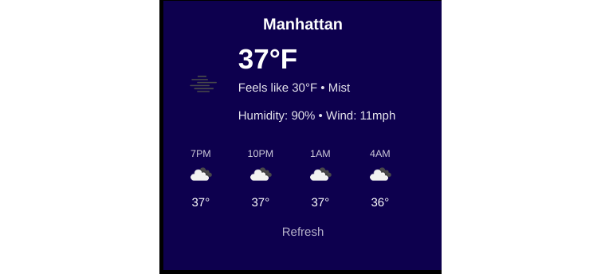

# Weather Widget

This is a customizable desktop weather widget built with Electron.

What the default widget looks like:


## System Requirements

- Node.js 16+
- npm 8+

## Setup

With [Node.js](https://nodejs.org/en) installed, you can set up the weather widget by following these steps:

1. Clone the repository:
```sh
git clone https://github.com/kepler-beckwith/weather-widget.git
cd weather-widget
```
2. Install dependencies:
```sh
npm install
```
3. Create your config file :
```sh
cp config.template.json config.json
```
4. Edit your config.json with your OpenWeatherMap API key and location coordinates:
```sh
{
  "weather": {
    "apiKey": "YOUR_API_KEY",
    "location": {
      "lat": "YOUR_LATITUDE",
      "lon": "YOUR_LONGITUDE"
    }
  }
}
```
5. Build and start the widget:
```sh
npm start
```
## Configuration
Get an API key from https://openweathermap.org/
Find your coordinates:
Open Google Maps
Right-click your location
Copy the coordinates
Update config.json with your details
Development
## Built using:

* Electron
* TypeScript
* OpenWeatherMap API

## Known Issues

* Currently tested only on Ubuntu

* Transparency effects may vary by desktop environment

* Manual refresh required after system sleep

## License
MIT License

